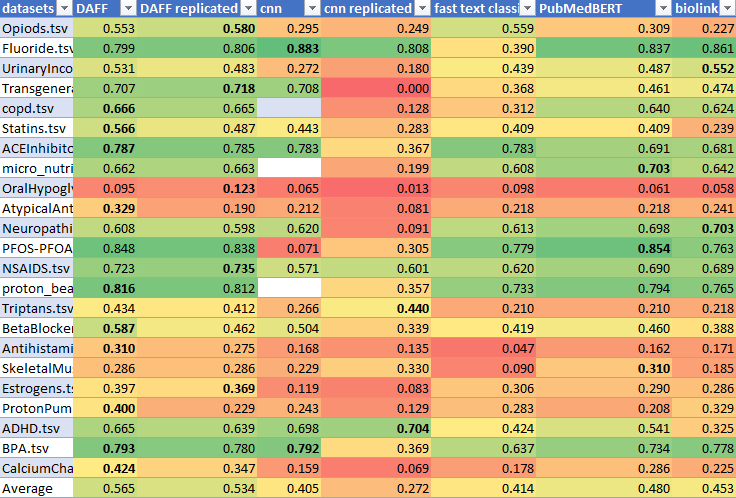

# Citation Screening with Deep Learning

## Overview
This project automates the process of citation screening, a critical step in systematic reviews of medical literature. The goal is to reduce the time required to filter relevant abstracts by using state-of-the-art deep learning models like BioLinkBERT and PubMedBERT, which are trained on PubMed abstracts and fine-tuned to perform citation filtering.

## Abstract
A systematic review involves synthesizing medical literature by summarizing the findings of multiple primary studies related to a subject, aiding decision-making through evidence-based insights. One crucial step in this process is citation screening, where researchers evaluate abstracts to identify relevant studies. This process is time-consuming, and traditional machine learning techniques like SVM and logistic regression, which require manual feature selection, have limitations.

In this project, transformer-based models such as BioLinkBERT and PubMedBERT are employed for citation screening. These models, pre-trained on PubMed abstracts, are fine-tuned for filtering citations, which reduces the workload for researchers. The models are tested on 23 publicly available systematic review datasets. To address the challenge of small datasets, we also explored language translation and PICO-based features, which capture essential components of medical abstracts. The results show that transformer models can filter up to 70% of citations for larger datasets.

**Note:** This project is for academic purposes and is not intended for replication or use by others.

## Installation Instructions

### Install the required libraries
* Install conda/miniconda for managing you environment  
    [conda download link](https://docs.conda.io/projects/conda/en/latest/user-guide/install/linux.html "Download miniconda from here")  
    Miniconda:  
    `bash Miniconda3-latest-Linux-x86_64.sh`  
    Anaconda:  
    `bash Anaconda-latest-Linux-x86_64.sh`  

*  Create a conda environment for the project  
   `conda create --name tf_citation python=3.9`  

*  activate conda  environment  
   `conda activate tf_citation`  

* setup Tensorflow GPU dependencies  
    [TF-GPU setup steps taken from here](https://www.tensorflow.org/install/pip)  
    Install tf-fpu dependencies  
  * `conda install -c conda-forge cudatoolkit=11.2 cudnn=8.1.0`
  * `mkdir -p $CONDA_PREFIX/etc/conda/activate.d`
  * `echo 'export LD_LIBRARY_PATH=$LD_LIBRARY_PATH:$CONDA_PREFIX/lib/' > $CONDA_PREFIX/etc/conda/activate.d/env_vars.sh`
  * `pip install --upgrade pip`

* Move into the project directory  
    `cd Project_dir`  
* Install all required libraries  
` pip install -r requirements.txt`  
* For running using pytorch  
`pip install torch==1.7.1+cu110 torchvision==0.8.2+cu110 torchaudio===0.7.2 -f https://download.pytorch.org/whl/torch_stable.html`  

### Running code
Inside the Project_dir run command
    `python main.py > out.txt`  
The final wss scores will be stored in the wss file

### Results 
In Report Directory  
Finetuned PubMedBert is our best result and the DAFF model is existing best industry model  

